# Deliverable 12 Penetration Testing

## Peer Names

- Tristan Weech
- Makenna Wilkerson

## Self Attack

### Tristan

#### Self Attack #1

| Item           | Result                                                                                                                                                                                                                                                                                                                            |
| -------------- | --------------------------------------------------------------------------------------------------------------------------------------------------------------------------------------------------------------------------------------------------------------------------------------------------------------------------------- |
| Date           | April 7, 2026                                                                                                                                                                                                                                                                                                                     |
| Target         | pizza.twpizza.click                                                                                                                                                                                                                                                                                                               |
| Classification | Password Attacks                                                                                                                                                                                                                                                                                                                  |
| Severity       | 4                                                                                                                                                                                                                                                                                                                                 |
| Description    | Through password attacks, my base admin account was found out and hacked. Not only was this hacking done through a simple password that a hacker could easily figure out and break into, it also revealed how logging in with an empty string password would be successful.                                                       |
| Images         | 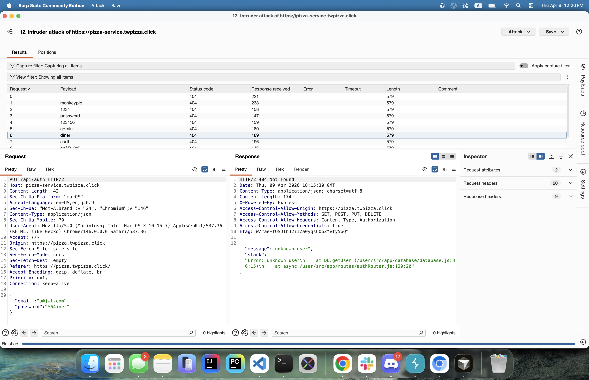   Burp Suite photo of password attacking after I had secured my system.                                                                                                                                                                                           |
| Corrections    | I have now changed my base admin account to have a more secure password, and I also have made it so that if you enter a password that is just empty strings, it fails to log the user in, in addition to a counter on how many times someone is trying to log in to stop hackers from password attacking or dictionary attacking. |

#### Self Attack #2

| Item           | Result                                                                                                                                                                                                                                                                |
| -------------- | --------------------------------------------------------------------------------------------------------------------------------------------------------------------------------------------------------------------------------------------------------------------- |
| Date           | April 7, 2026                                                                                                                                                                                                                                                         |
| Target         | pizza.twpizza.click                                                                                                                                                                                                                                                   |
| Classification | Man-in-the-Middle                                                                                                                                                                                                                                                     |
| Severity       | 4                                                                                                                                                                                                                                                                     |
| Description    | Users could use a Man-in-the-Middle software/middleware to adjust the order HTTP request to change different aspects of it, such as ordering from a different store, or worse off, having the cost of the pizza be negative value, which made the company lose money. |
| Images         | 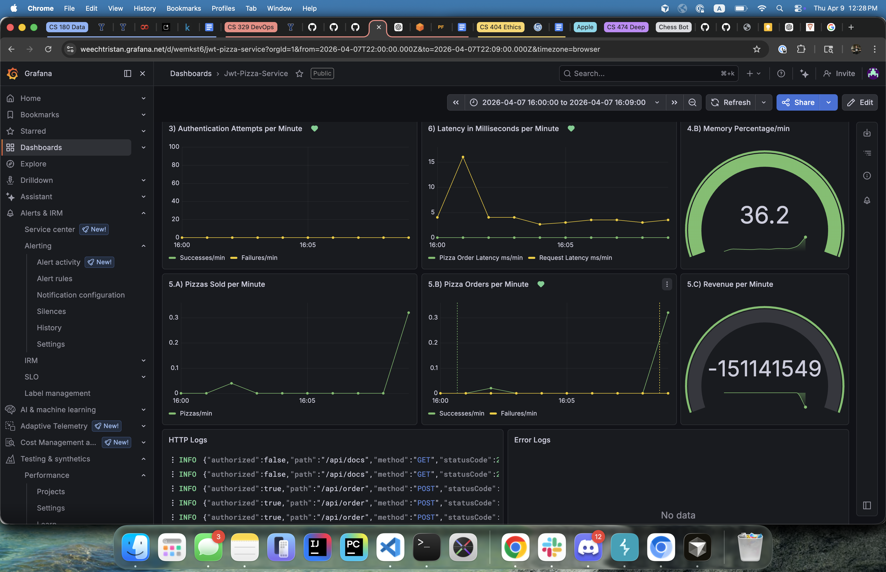   Grafana showing how damaging this Man in the Middle attack can be.                                                                                                                                               |
| Corrections    | Now when a order comes in, I verify all the information that comes in with data from the backend to ensure that nothing is changed by a malicious user.                                                                                                               |

#### Self Attack #3

| Item           | Result                                                                                                                                                                                                                                                                                                                                                                                                                                                                                                                                                                                                                           |
| -------------- | -------------------------------------------------------------------------------------------------------------------------------------------------------------------------------------------------------------------------------------------------------------------------------------------------------------------------------------------------------------------------------------------------------------------------------------------------------------------------------------------------------------------------------------------------------------------------------------------------------------------------------- |
| Date           | april 9, 2026                                                                                                                                                                                                                                                                                                                                                                                                                                                                                                                                                                                                                    |
| Target         | pizza.twpizza.click                                                                                                                                                                                                                                                                                                                                                                                                                                                                                                                                                                                                              |
| Classification | Insider Threats                                                                                                                                                                                                                                                                                                                                                                                                                                                                                                                                                                                                                  |
| Severity       | 4                                                                                                                                                                                                                                                                                                                                                                                                                                                                                                                                                                                                                                |
| Description    | By having insider information, you can go to the Github repository of the backend, and if it hasn't been cleared recently, you can look into the workflows and snag very important classified information from downloading the artifact. This can include information such as jwtSecret, db connection information (host, user, password, database, connectTimeout), factory url and api key, metrics info (source, endpointUrl, apiKey, accountId), and logging info (source, endpointUrl, accountId, and apiKey). With this information, they could hack into the database, or use the jwtSecret to sign invalid pizza orders. |
| Images         | 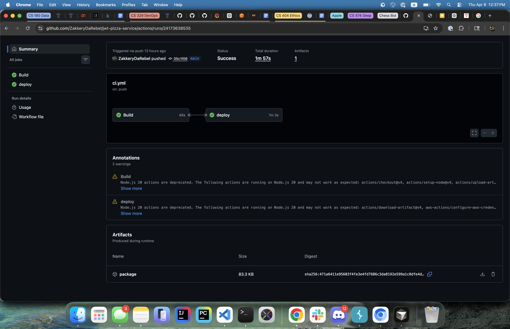   Github keeping the artifact that was used, which in turn can be downloaded and contains all the config file secrets that were meant to be kept hidden.                                                                                                                                                                                                                                                                                                                                                                                                                      |
| Corrections    | I am ensuring that as I have finished the workflow, I am going through and deleted the artifacts, and deleting older workflows as well that are no longer needed.                                                                                                                                                                                                                                                                                                                                                                                                                                                                |

#### Self Attack #4

| Item           | Result                                                                                                                                                                                                                                                                                                                                                                                                                                                                     |
| -------------- | -------------------------------------------------------------------------------------------------------------------------------------------------------------------------------------------------------------------------------------------------------------------------------------------------------------------------------------------------------------------------------------------------------------------------------------------------------------------------- |
| Date           | April 9, 2026                                                                                                                                                                                                                                                                                                                                                                                                                                                              |
| Target         | pizza.twpizza.click                                                                                                                                                                                                                                                                                                                                                                                                                                                        |
| Classification | Insider Threats                                                                                                                                                                                                                                                                                                                                                                                                                                                            |
| Severity       | 1                                                                                                                                                                                                                                                                                                                                                                                                                                                                          |
| Description    | Going to the Grafana logs, you can look into information that can lead to having insider information. But thanks to our Deliverable 9 (Logging), I was able to sanitize the lgos beforehand, and hide the most important information away from malicious eyes. But there is still some information that could be used to have an understanding of what is happening in the backend, but I don't believe it as anything too important that would harm users or the company. |
| Images         | 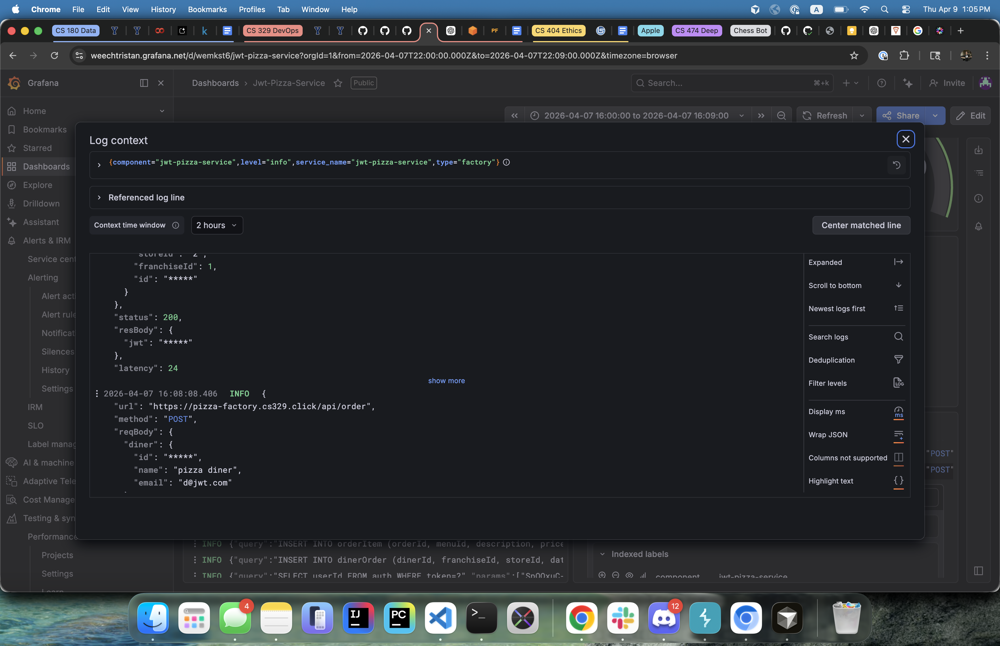   Because the Grafana logs are sanitized, little to none important information has been shared to those who shouldn't have the information.                                                                                                                                                                                                                                                                   |
| Corrections    | Nothing at the moment, but a discussion could be undertaken to debate what information should be sanitzied and aren't currently..                                                                                                                                                                                                                                                                                                                                          |

### Makenna did not prepare and attack herself :(

## Peer Attack

### Tristan toward Makenna's website

#### Attack #1

| Item           | Result                                                                                   |
| -------------- | ---------------------------------------------------------------------------------------- |
| Date           | April 9, 2026                                                                            |
| Target         | pizza.makenna.click                                                                      |
| Classification | Zero-Day Exploit                                                                         |
| Severity       | 4                                                                                        |
| Description    | Tristan paid himself 1 billion bitcoin ordering a pizza, by sending a customized request |
| Images         | 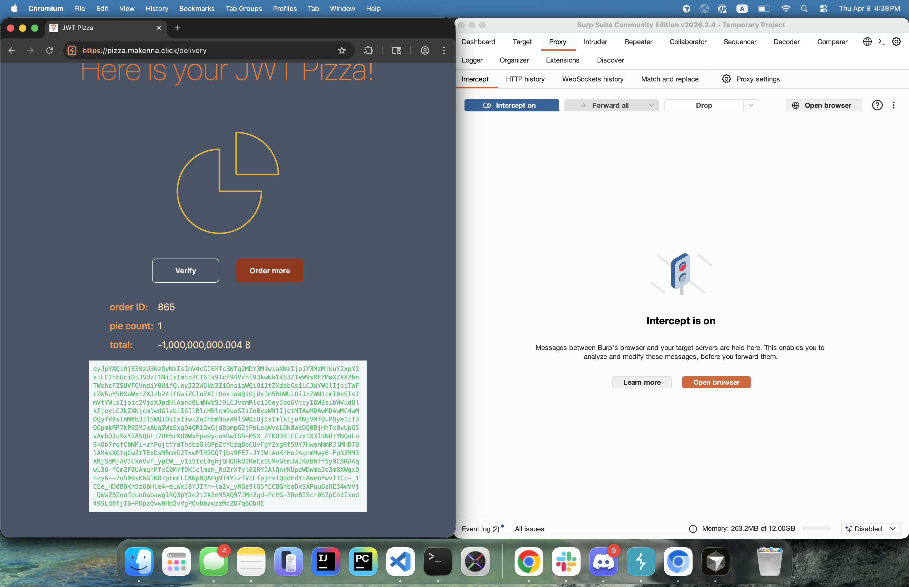                                                                  |
| Corrections    | Validate user inputs on http requests for pizza orders.                                  |

#### Attack #2

| Item           | Result                                                      |
| -------------- | ----------------------------------------------------------- |
| Date           | April 9, 2026                                               |
| Target         | pizza.makenna.click                                         |
| Classification | SQL Injection                                               |
| Severity       | 0                                                           |
| Description    | Tristan failed to initiate a SQL injection on a login call. |
| Images         | 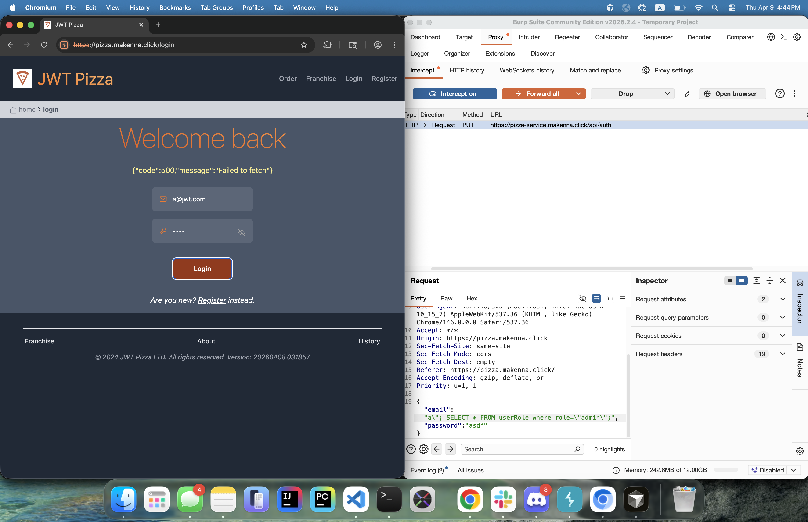                                     |

#### Attack #3

| Item           | Result                                                                                                                                                             |
| -------------- | ------------------------------------------------------------------------------------------------------------------------------------------------------------------ |
| Date           | April 9, 2026                                                                                                                                                      |
| Target         | pizza.makenna.click                                                                                                                                                |
| Classification | Password Attack                                                                                                                                                    |
| Severity       | 3                                                                                                                                                                  |
| Description    | Tristan used a default password to log into pizza franchisee, then proceeded to close all the stores, as well as open a new one under the pizza franchisee's name. |
| Images         | 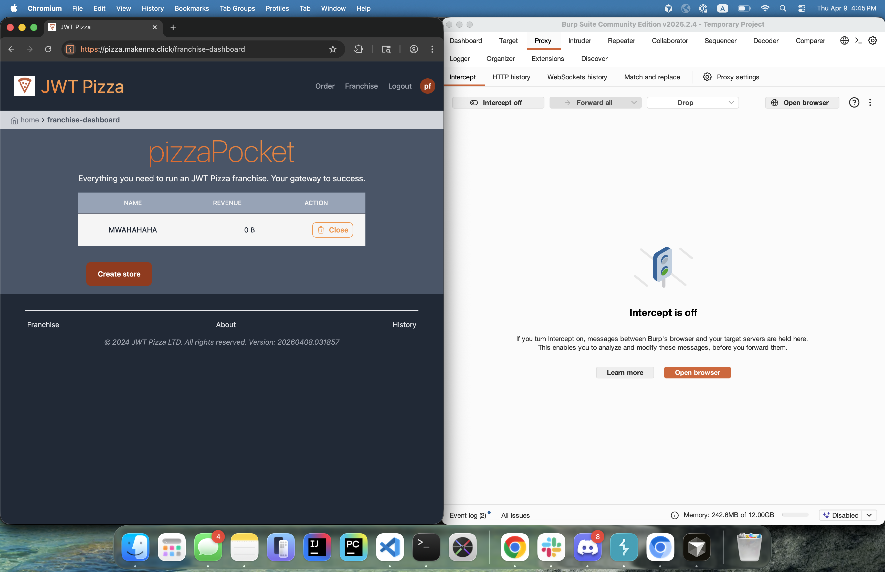                                                                                                                                            |
| Corrections    | Add feature from deliverable 4 to change passwords and change them from defaults                                                                                   |

#### Attack #4

| Item           | Result                                                                                                                                                                                               |
| -------------- | ---------------------------------------------------------------------------------------------------------------------------------------------------------------------------------------------------- |
| Date           | April 9, 2026                                                                                                                                                                                        |
| Target         | pizza.makenna.click                                                                                                                                                                                  |
| Classification | Insider Threat                                                                                                                                                                                       |
| Severity       | 3                                                                                                                                                                                                    |
| Description    | From the jwt-pizza-service repository, Tristen was able to download the artifact produced by the github action, which contained the default admin login, allowing him to edit franchise information. |
| Images         | 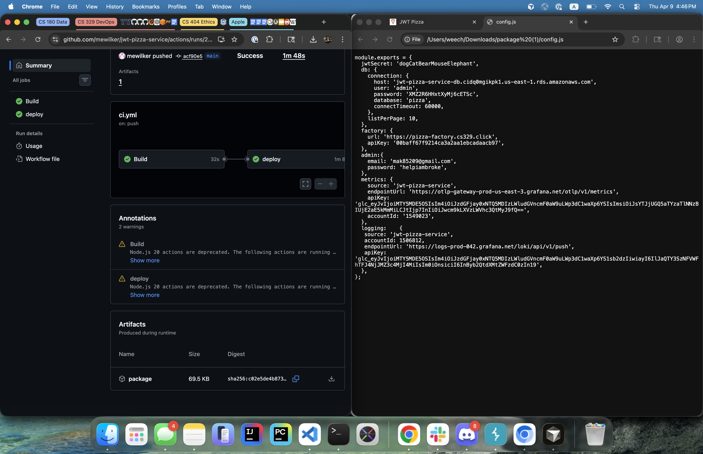                                                                                                                                                                              |
| Corrections    | As part of the publishing workflow, remove the artifact when finished deploying.                                                                                                                     |

#### Attack #5

| Item           | Result                                                                                                                                                      |
| -------------- | ----------------------------------------------------------------------------------------------------------------------------------------------------------- |
| Date           | April 9, 2026                                                                                                                                               |
| Target         | pizza.makenna.click                                                                                                                                         |
| Classification | Injection                                                                                                                                                   |
| Severity       | 0                                                                                                                                                           |
| Description    | After gaining login access, Tristan copied the authtoken to another request, hoping to make a request after the admin had logged out. This did not succeed. |
| Images         | 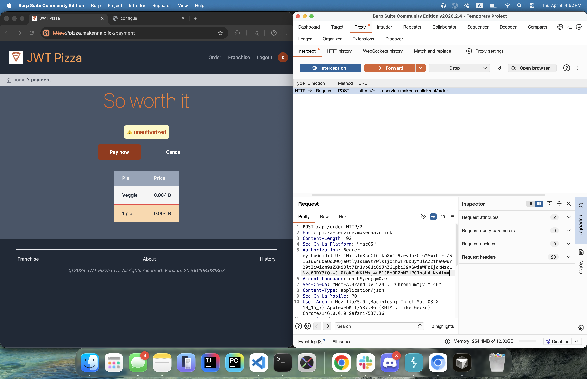                                                                                                                                     |

### Makenna toward Tristan's website

#### Attack #1

| Item           | Result                                                                                                                                                                                                                                                             |
| -------------- | ------------------------------------------------------------------------------------------------------------------------------------------------------------------------------------------------------------------------------------------------------------------ |
| Date           | April 9, 2026                                                                                                                                                                                                                                                      |
| Target         | pizza.twpizza.click                                                                                                                                                                                                                                                |
| Classification | Password Attack                                                                                                                                                                                                                                                    |
| Severity       | 0                                                                                                                                                                                                                                                                  |
| Description    | Makenna tried to password attack Tristan's website, using a variety of different attacks, but could not find any information that would allow them to successfully login in. In addition, Makenna got blocked for trying to sign in too many times on one account. |
| Images         | 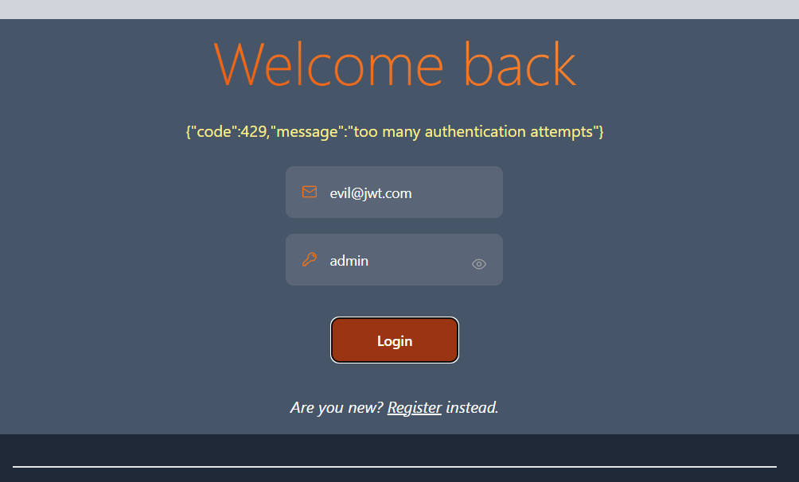   Having too many authentication attempts is suspicious and gets stopped.                                                                                                                       |
| Corrections    | No corrections are necessary.                                                                                                                                                                                                                                      |

#### Attack #2

| Item           | Result                                                                                                                                                                                                                                        |
| -------------- | --------------------------------------------------------------------------------------------------------------------------------------------------------------------------------------------------------------------------------------------- |
| Date           | April 9, 2026                                                                                                                                                                                                                                 |
| Target         | pizza.twpizza.click                                                                                                                                                                                                                           |
| Classification | Man-in-the-middle                                                                                                                                                                                                                             |
| Severity       | 0                                                                                                                                                                                                                                             |
| Description    | Makenna tried to change the information that goes into an order and see if she could get a 'RAINBOW' pizza for free. She encountered an error code instead of getting a pizza for free as the backend would not allow her to have this order. |
| Images         | 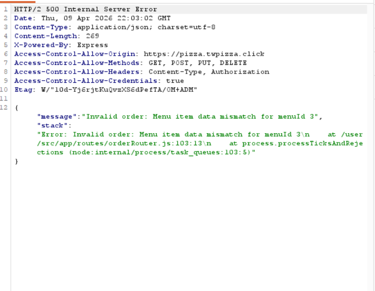   The backend was able to look into the database to verify the order information, and not blindly trust any request that comes through.                                |
| Corrections    | No corrections are necessary.                                                                                                                                                                                                                 |

#### Attack #3

| Item           | Result                                                                                                                                                                                                                                                                                                                                                                                                    |
| -------------- | --------------------------------------------------------------------------------------------------------------------------------------------------------------------------------------------------------------------------------------------------------------------------------------------------------------------------------------------------------------------------------------------------------- |
| Date           | April 9, 2026                                                                                                                                                                                                                                                                                                                                                                                             |
| Target         | pizza.twpizza.click                                                                                                                                                                                                                                                                                                                                                                                       |
| Classification | Zero-Day Exploit                                                                                                                                                                                                                                                                                                                                                                                          |
| Severity       | 1                                                                                                                                                                                                                                                                                                                                                                                                         |
| Description    | By trying a variety of different attacks, Makenna was able to obtain a couple of different information in the Network tab of the inspector, connected to the error and Tristan's attached stack trace. Makenna couldn't do too much with the information, but someone with potentially more experience could use the information based on my code to launch a more vicious attack to hack into my system. |
| Images         |    Having this information is great for logs, but could be exploited by a malicious user.                                                                                                                                                                                                                                                       |
| Corrections    | Remove the stack information from the error response, but make sure it is added to the logs if wanted.                                                                                                                                                                                                                                                                                                    |

#### Attack #4

| Item           | Result                                                                                                                                                                                                                                                                                                                                                                                   |
| -------------- | ---------------------------------------------------------------------------------------------------------------------------------------------------------------------------------------------------------------------------------------------------------------------------------------------------------------------------------------------------------------------------------------- |
| Date           | April 9, 2026                                                                                                                                                                                                                                                                                                                                                                            |
| Target         | pizza.twpizza.click                                                                                                                                                                                                                                                                                                                                                                      |
| Classification | SQL Injection                                                                                                                                                                                                                                                                                                                                                                            |
| Severity       | 0                                                                                                                                                                                                                                                                                                                                                                                        |
| Description    | Makenna tried to do an SQL Injection by changing the url parameters of getting a franchise to something that shouldn't work. Instead, Tristan's code ignored the changes, and returned information as if nothing happened. This proves that the SQL injection attack failed, but it does raise the question if Tristan's code should shut down the request or not because of the attack. |
| Images         | 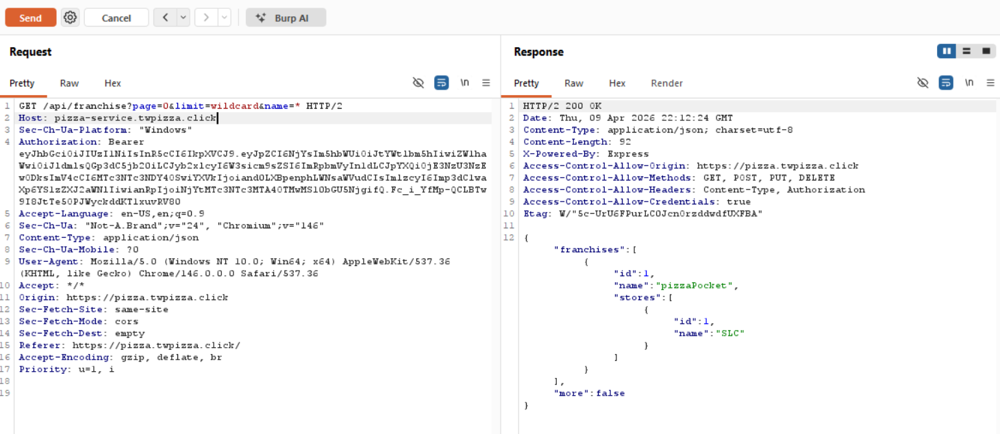   At the top line, we see an SQL attack in the url parameters, but Tristan's code ignores the attack and still just returns a normal 200 status code response.                                                                                                                                                                                |
| Corrections    | Go through the code, and see how SQL injections are being taken care of, and see if it should be required to shut down the requests or not based on how the injection attack is happening.                                                                                                                                                                                               |

#### Attack #5

| Item           | Result                                                                                                                                                                                                                                                                                                                                                                                                                                                                                                                                                                                                       |
| -------------- | ------------------------------------------------------------------------------------------------------------------------------------------------------------------------------------------------------------------------------------------------------------------------------------------------------------------------------------------------------------------------------------------------------------------------------------------------------------------------------------------------------------------------------------------------------------------------------------------------------------ |
| Date           | April 9, 2026                                                                                                                                                                                                                                                                                                                                                                                                                                                                                                                                                                                                |
| Target         | pizza.twpizza.click                                                                                                                                                                                                                                                                                                                                                                                                                                                                                                                                                                                          |
| Classification | Zero-Day Exploit                                                                                                                                                                                                                                                                                                                                                                                                                                                                                                                                                                                             |
| Severity       | 4                                                                                                                                                                                                                                                                                                                                                                                                                                                                                                                                                                                                            |
| Description    | By going to Tristan's backend /api/docs information, Makenna was able to find where Tristan was hosting his database on, and it's URL. Exposing this information is not very great, but since I have IAM accounts to protect it, it wasn't penetrated. But theoretically it could lead to future hacking with that information out in the wild. This also exposed Tristan's default pizza diner and franchise account, which then lead to a password attack that allowed Makenna to get into his Franchise account, delete his stores, then create a new one with negative revenue, bankrupting his company. |
| Images         | 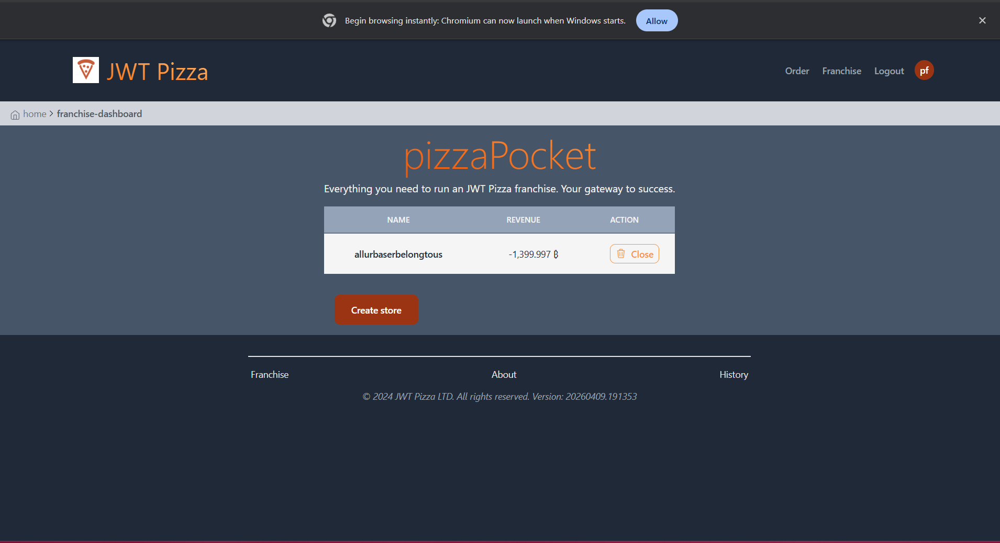   Having created a new store, there is negative revenue! That doesn't seem good.                                                                                                                                                                                                                                                                                                                                                                                                                                                       |
| Corrections    | Remove that information from backend /api/docs to hide where my backend is being stored. In addition, change all default account information to not be shown on /api/docs.                                                                                                                                                                                                                                                                                                                                                                                                                                   |

## Summary of learning

Tristan and Makenna found multiple lessons about secure deployment. We needed to change our default passwords and not commit them to a public space. Makenna needed to clean up from insider threats. We needed to vet AI suggestions for security, as Tristan added a stack trace to his error messages, per AI request. Tools like Burp Suite helped us to automate attacks. We also should have checked edge cases in unit tests, as well as run some smoke tests.
